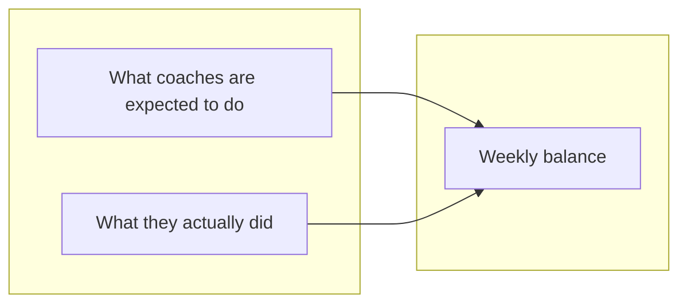
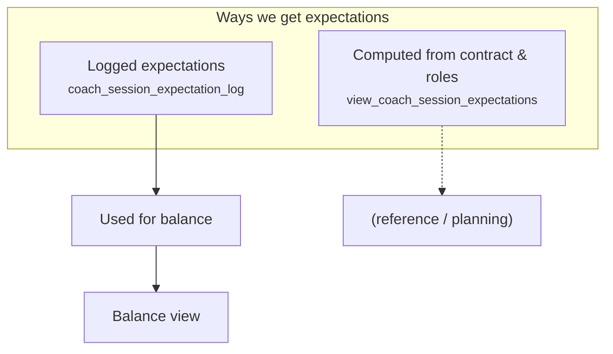
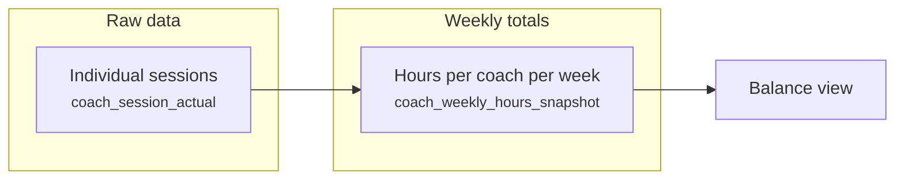
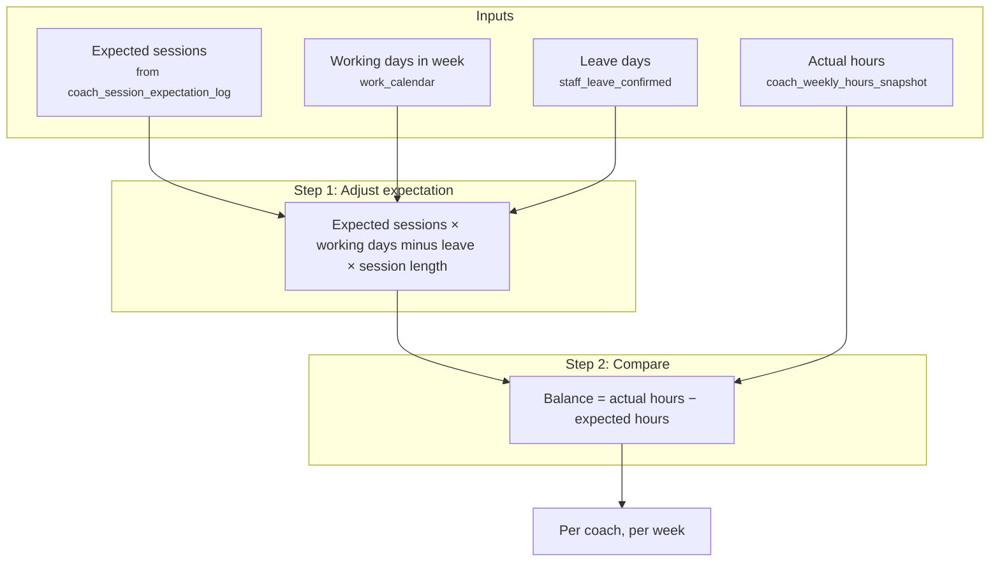
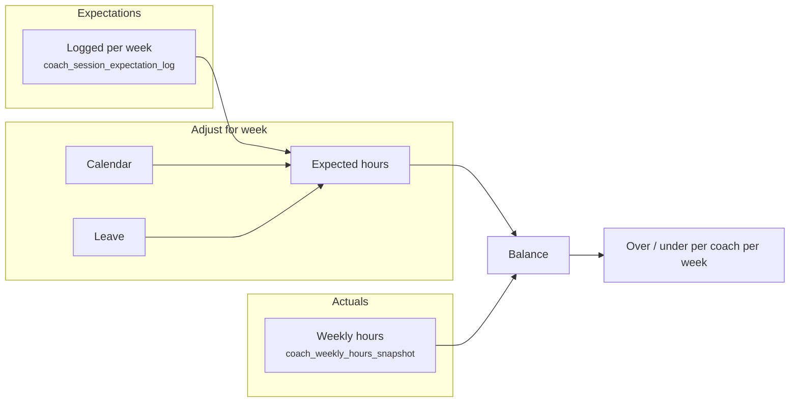

# Session balance – how the data flows

A short guide to how **expected sessions**, **actual hours**, and **weekly balance** fit together.

---

## The big picture

**Expectations** (sessions we expect per week) and **actuals** (hours they worked) are combined to produce a **weekly balance** (over or under).

<small>Sources: expectations from log or computed view; actuals from weekly snapshot; balance from `view_coach_session_balance_sep25`.</small>

---

## Where do expectations come from?

Two ways the system knows “how many sessions” a coach is expected to do:

| Source | What it is | Used for |
|--------|------------|----------|
| **Logged** | A row per coach per week with expected sessions and role hours. | The balance view uses this. |
| **Computed** | Contract hours minus role hours, turned into “contract sessions” for future weeks. | Planning / reference. |

<small>Table: `coach_session_expectation_log`. View: `view_coach_session_expectations` (uses `get_role_hours_for_week`, `system_config`).</small>

---

## Where do actuals come from?

- **Sessions**: each session (date, coach, attended, etc.) is stored as a row.
- **Snapshot**: those are rolled up into **actual hours per coach per week**. The balance view uses this snapshot.

<small>Tables: `coach_session_actual` → `coach_weekly_hours_snapshot`. Balance view reads `coach_weekly_hours_snapshot.actual_hours`.</small>

---

## How is the balance calculated?

The “Sep 25” balance view does three things: get expectations, adjust them for the week, then compare to actuals.

In words:

1. **Adjust expected hours**  
   Take expected sessions for the week, scale by “how many working days minus leave,” then multiply by session length (e.g. 0.8h from `get_perform_hours()`).

2. **Compare**  
   Balance = actual hours (from snapshot) − that adjusted expected hours.

3. **Result**  
   One balance per coach per week (over or under).

<small>View: `view_coach_session_balance_sep25`. Uses `staff_database`, `work_calendar`, `staff_leave_confirmed`, `coach_weekly_hours_snapshot`, `get_perform_hours()`.</small>

---

## End-to-end flow (one diagram)

**Flow:** Logged expectations + calendar + leave → **expected hours**. Weekly snapshot → **actual hours**. Expected vs actual → **balance**.

<small>Main view: `view_coach_session_balance_sep25`.</small>

---

## Quick reference

| Term | Meaning |
|------|--------|
| **Session expectation** | How many sessions we expect a coach to do that week. |
| **Expected hours (adjusted)** | That expectation converted to hours, adjusted for working days and leave. |
| **Actual hours** | Hours from the weekly snapshot (from session data). |
| **Balance** | Actual hours − expected hours (positive = over, negative = under). |

<small>Key table: `coach_session_expectation_log`. Key view: `view_coach_session_balance_sep25`. Snapshot: `coach_weekly_hours_snapshot`.</small>
